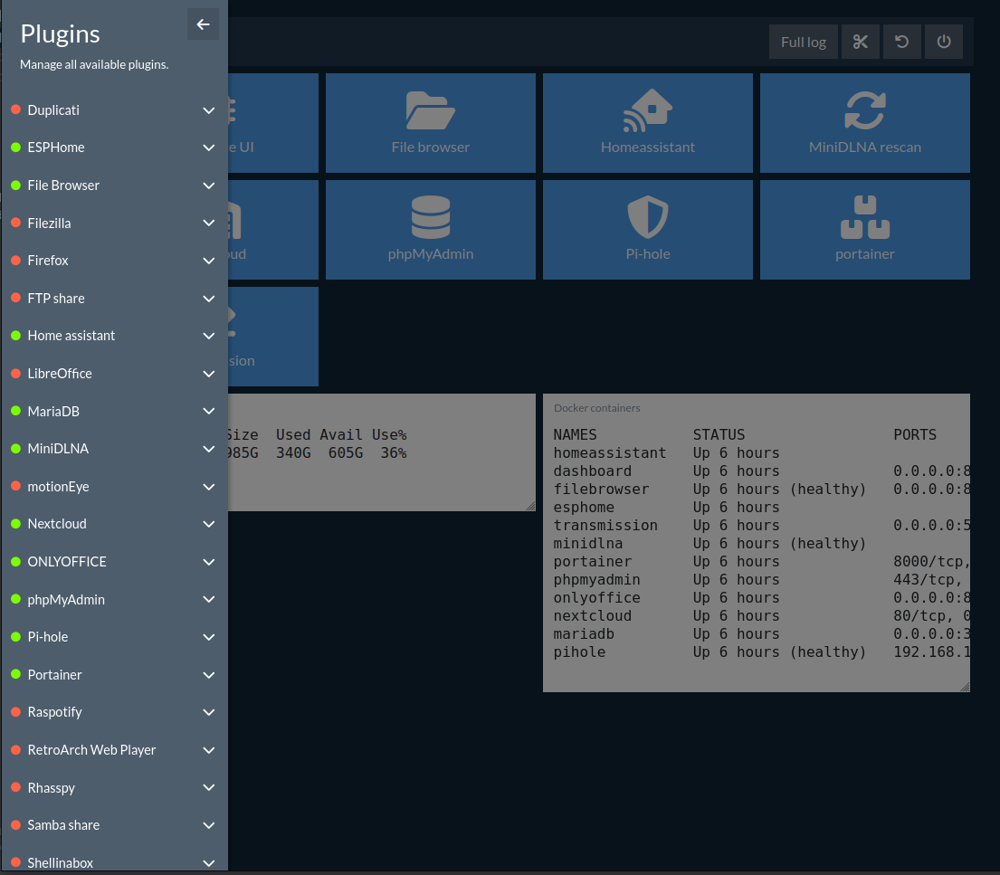

# dockÔS
```
Noun, [do.kós]
The main beam, especially in a house
```
Almost zero-configuration deployments of docker containers useful in a home server.

* Duplicati https://hub.docker.com/r/linuxserver/duplicati
* ESPHome https://hub.docker.com/r/esphome/esphome
* File Browser https://hub.docker.com/r/filebrowser/filebrowser
* FileZilla https://hub.docker.com/r/linuxserver/filezilla
* Firefox https://hub.docker.com/r/linuxserver/firefox
* FTP server https://hub.docker.com/r/delfer/alpine-ftp-server
* Home Assistant https://hub.docker.com/r/homeassistant/home-assistant
* LibreOffice https://hub.docker.com/r/linuxserver/libreoffice
* MariaDB https://hub.docker.com/_/mariadb
* MiniDLNA https://hub.docker.com/r/vladgh/minidlna
* MotionEye https://hub.docker.com/r/ccrisan/motioneye
* Nextcloud https://hub.docker.com/r/linuxserver/nextcloud
* Nginx https://hub.docker.com/_/nginx
* ONLYOFFICE https://hub.docker.com/r/onlyoffice/documentserver
* phpMyAdmin https://hub.docker.com/r/linuxserver/phpmyadmin
* Pi-hole https://hub.docker.com/r/pihole/pihole
* Portainer CE https://hub.docker.com/r/portainer/portainer-ce
* Raspotify https://hub.docker.com/r/derkades/raspotify
* RetroArch Web https://hub.docker.com/r/inglebard/retroarch-web
* Rhasspy https://hub.docker.com/r/rhasspy/rhasspy
* Samba server https://hub.docker.com/r/dperson/samba
* shellinabox https://hub.docker.com/r/sspreitzer/shellinabox
* Transmission https://hub.docker.com/r/linuxserver/transmission
* VS Code https://hub.docker.com/r/linuxserver/code-server
* WireGuard manager https://hub.docker.com/r/perara/wg-manager



### Installation
```shell
cd ~ && \
sudo apt install -y ssh git docker-compose openssl && \
git clone https://github.com/poulou0/dock-os.git && \
cp ./dock-os/.env.dist ./dock-os/.env && \
echo "Give the username of a sudoer" && read && sed -i "s/USER=.*/USER=$REPLY/g" ./dock-os/.env && \
echo "Give the password of the sudoer" && read -s && sed -i "s/PASSWORD=.*/PASSWORD=$REPLY/g" ./dock-os/.env && \
sed -i "s|ROOT_DIR=.*|ROOT_DIR=$PWD\/dock-os|g" ./dock-os/.env && \
mkdir ./dock-os/nginx/certs && openssl req -newkey rsa:2048 -nodes -x509 -days 3650 -subj "/C=GR" \
  -keyout ./dock-os/nginx/certs/dashboard.key -out ./dock-os/nginx/certs/dashboard.crt && \
sudo docker-compose -f ./dock-os/docker-compose.yml up -d
```

### Usage
* Dashboard: `https://<ip>`
* File manager: `http://<ip>:8000`
* MiniDLNA status: `http://<ip>:8200`
* ...

<details>
  <summary>Nerdier notes</summary>

  ### File browser
  Under Settings > Global Settings > Command runner > After Copy/Delete/Rename/Save/Upload
  ```shell
  curl http://$(/sbin/ip route|awk '/default/ { print $3 }')/minidlna-rescan
  ```
  NOT WORKING, but promising!
  ```shell
  sudo docker-compose exec filebrowser /filebrowser cmds add after_copy "curl http://\$(/sbin/ip route|awk '/default/ { print \$3 }')/minidlna-rescan" && \
  sudo docker-compose exec filebrowser /filebrowser cmds add after_delete "curl http://\$(/sbin/ip route|awk '/default/ { print \$3 }')/minidlna-rescan" && \
  sudo docker-compose exec filebrowser /filebrowser cmds add after_rename "curl http://\$(/sbin/ip route|awk '/default/ { print \$3 }')/minidlna-rescan" && \
  sudo docker-compose exec filebrowser /filebrowser cmds add after_save "curl http://\$(/sbin/ip route|awk '/default/ { print \$3 }')/minidlna-rescan" && \
  sudo docker-compose exec filebrowser /filebrowser cmds add after_upload "curl http://\$(/sbin/ip route|awk '/default/ { print \$3 }')/minidlna-rescan"
  ```
  To list them `sudo docker-compose exec filebrowser /filebrowser cmds ls`

  ### miniDLNA
  Control url: `http://<ip>:8200/rootDesc.xml`

  Example to get "All videos" XML
  ```shell
  curl http://<ip>:8200/ContentDir.xml -H 'SOAPAction:urn:schemas-upnp-org:service:ContentDirectory:1#Browse' --data '<ObjectID>2$8</ObjectID><BrowseFlag>BrowseDirectChildren</BrowseFlag>'
  ```
  Source: https://developer.sony.com/develop/audio-control-api/get-started/browse-dlna-file
</details>

### TODO

* Make a 'purge config' button for every entry when its stopped (and/or system prune -a --volumes https://docs.docker.com/engine/reference/commandline/system_prune/)
